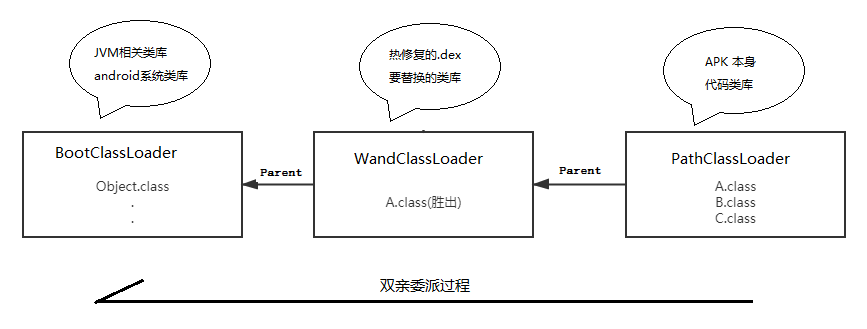

# WandFix

[](https://jitpack.io/#miqt/WandFix)

本项目旨在实现像web开发一样开发Android，代码写好发布之后就能让用户立即看到，而不是必须每次打包apk -> 更新 -> 安装，实现方式是Activity和资源文件的动态替换。   
  
2019年12月27日14:58:43 本项目替换了热修复的方式，由之前的反射替换类的方式，改为了使用Hack Classloader mParent的方式。

众所周知，在android中正常情况下有两个ClassLoader，分别是，BootCLassLoader - PathClassLoader 

当加载一个类的时候，基于双亲委托，先由BootCLassLoader 加载这个类，如果BootCLassLoader不存在，则由PathClassLoader加载这个类。

而本项目的核心替换方法就是，在BootCLassLoader - PathClassLoader 中间，插入了一个自定义的WandClassLoader，这样，当我们的项目加载一个类的时候，会先试用WandCLassLoader 加载，我们就达到替换的目的了，相对于替换之前，达到了无使用反射的目的。


  
## About
  
WandFix是一个可以使用注解来注入实现类对象的库，基于java APT+反射+classloader，因此不需要使用new来初始化对象。另外它还可以动态加载指定.apk .dex .jar .class文件，使用注入设置优先级的方式来选择注入class类的来源，因此利用此种方法，该项目还可以使得被注解的类获得热修复的能力！  

使用 WandFix 只需要对变量名添加注解即可实现对象的注入。而热修复功能的实现既是用对象注入的这种途径，通过更换热修复包替换实现类，来达到每次注入的对象都为最后改动过的，实现热修复的目的。当然，如果您不想使用热修复功能，只是想方便的注入对象，直接添加注解也是可以的，因为如果它在热修复包中没有找到对应的实现类的话，会尝试从项目本地来加载对应的类，保证程序的稳定。

本项目Demo效果预览：（*2019年4月12日17:23:29 更新*： 针对使用这个项目进行实际的项目开发，我还写了一个简单的项目，它或许是使用本项目开发的一个比较好的示例。[传送门](https://github.com/miqt/xiaotuVip)）


优点：
- 类似于黄油刀可以直接对成员变量添加@InjectObject("实现类全名")注解,来绑定热修复包中的实现类。
- 无需关闭应用即可使修复包生效。
- 与mvp模式搭配使用效果最佳。
- 可以自己定义需要热修复的类。
- 可以自己配置dex加密算法，保护dex文件的安全。
- 可以通过注解单独设置某个对象是否禁用双亲委托。
- [Activity动态代理](https://github.com/miqt/WandFix/wiki/Activity%E5%8A%A8%E6%80%81%E4%BB%A3%E7%90%86%E4%BD%BF%E7%94%A8%E6%96%B9%E6%B3%95%E5%8F%8A%E5%AE%9E%E7%8E%B0%E5%8E%9F%E7%90%86)功能，2019-2-19 新增
- 支持加载外部布局、图标、颜色等资源文件。


## 使用方法：

在项目根目录的build.gradle添加：
```
allprojects {
	repositories {
		...
		maven { url 'https://jitpack.io' }
	}
}
```

然后在:app:添加依赖：

```
annotationProcessor  'com.github.miqt.WandFix:wand-compiler:v1.3.6'
compile  'com.github.miqt.WandFix:wand:v1.3.6'
```

- [实现activity动态代理](#实现activity动态代理)
- [实现单个类文件的热修复](#实现单个类文件的热修复)
- [加载apk插件中的资源文件](#加载apk插件中的资源文件)


### 实现activity动态代理

activity动态代理就是把一个activity的全部事情，都交给一个代理类去处理，而这个代理本质上也是一个类，一个对象，因此我们只要使用DexClassloader一替换，即变成了动态代理。

先新建一个activity，继承[ProxyActivity](./wand/src/main/java/com/miqt/wand/activity/ProxyActivity.java)，然后添加`@BindProxy`注解
```java
//绑定代理类
@BindProxy(clazz = TextActivityProxy.class)
//必须继承 ProxyActivity
public class TextActivity extends ProxyActivity {
    //这里什么都不用写
}
```

然后新建一个class 继承 [ActivityProxy](./wand/src/main/java/com/miqt/wand/activity/ActivityProxy.java) 实现代理方法

```java
//每个代理类都要设置
@AddToFixPatch
public class TextActivityProxy extends ActivityProxy {
    public TextActivityProxy(ProxyActivity acty) {
        super(acty);
    }
    @Override
    public void onCreate(@Nullable Bundle savedInstanceState) {
        mActy.setContentView(R.layout.activity_hello);
        ...
    }
    ...
}
```

直接`startActivity(new Intent(this,TextActivity.class));`启动这个activity，代理就生效了，后来如果改动代理类，可以直接通过打包热修复包下发下去。


### 实现单个类文件的热修复

```java
public class MainActivity extends AppCompatActivity implements Wand.MotorListener {

    @InjectObject(
            //指向类的全名
            value = "com.miqt.demo.presenter.AppPresenterImpl",
            //设置双亲委托
            //项目开发中建议使用PROJECT，优先应用本地类库。
            //项目发布时，应修改为NEVER，优先应用热修复包中的类库。
            level = ParentalEntrustmentLevel.NEVER)
    AppPresenter ap;

    @Override
    protected void onCreate(Bundle savedInstanceState) {
        super.onCreate(savedInstanceState);
        setContentView(R.layout.activity_main);
        //可以在application中初始化一次即可
        Wand.get().init(this).listener(this);
    }

    public void getStr(View view) {
        //使用注解注入对象必须要调用这一行
        ClassInstall.inject(this);
        //或者带参数的构造方法
        //Map<String, Object[]> pramHouse=new HashMap<>();
        //pramHouse.put("com.miqt.demo.presenter.AppPresenterImpl",new Object[]{"hello"});
        //ClassInstall.inject(this,pramHouse);

        //也可以不使用注解注入的方式初始化对象
        //ap= ObjectFactory.make("com.miqt.demo.presenter.AppPresenterImpl"/*,构造参数*/);
        //ap= ObjectFactory.make(AppPresenterImpl.class/*,构造参数*/);

        String str = ap.getStr();
        Toast.makeText(this, str, Toast.LENGTH_SHORT).show();
    }
}
```

### 加载apk插件中的资源文件

```java
        //先根据apk插件文件路径创建PluginResources
        //需要文件读写权限才行
        PluginResources manager = new PluginResources(context, pluginApkPath);

        //颜色资源加载
        int id=manager.getId("text_color", "color");
        int color = manager.getResources().getColor(id, context.getTheme());
        textView.setTextColor(color);

        //布局加载
        View main_layout=manager.getLayout("activity_main");
```


### 相关注解用法及作用说明

1. @InjectObject 添加到成员变量上，对该成员变量注入对象
2. @AddToFixPatch 添加到类上，无需参数，表示该类是热修复相关的类，在编译期生成打包脚本的时候会将打了这个注释的类添加到打包列表中，如果有@InjectObject注解指定过的类，也可以不加。
3. @BindProxy 添加到activity类上，绑定指定的activity代理

### 代码混淆相关

如果项目设置了混淆，需要将以下代码复制到混淆配置文件中：
```
-keep class com.miqt.wand.**{*;}
-keep class * {@com.miqt.wand.anno.InjectObject <fields>;}
-keep @com.miqt.wand.anno.AddToFixPatch class * {*;}
-keep @com.miqt.wand.anno.BindProxy class * {*;}
```

## Other
千里之行，始于足下，欢迎提出问题和宝贵意见。

[如何创建并应用热修复包](https://github.com/miqt/WandFix/wiki/%E5%A6%82%E4%BD%95%E5%88%9B%E5%BB%BA%E5%B9%B6%E5%BA%94%E7%94%A8%E7%83%AD%E4%BF%AE%E5%A4%8D%E5%8C%85)

具体更多用法请移步[Wiki](https://github.com/miqt/WandFix/wiki)

如果您觉得这个项目还不错，就点个star吧(￣▽￣)~*

## 开发中遇到的问题和现存问题

- [x] targetVersion > 25 的时候，activity代理不生效(已经解决)
- [x] 热修复包中如果有匿名内部类，则报java.lang.NoClassDefFoundError(已经解决)
- [x] activity代理中如果使用了findviewbyid，有的时候找到的控件为空或类型转换异常(已经解决)
- [ ] 对于混淆处理的还不太好，因为反射的原因，如果混淆就会ClassNotfoundException，而不混淆的话对于源码的保护则没有保障，不过我目前想到了几个方案，还没有实施。
    - [ ] 方案一：通过解析.\app\build\outputs\mapping\debug\mapping.txt这个文件获得原始的类、方法和名称与混淆代码间的映射关系，然后在代码中找到对应的类。
    - [ ] 方案二：实施dex加壳，热修复包实际上是个dex文件，而如果自定义一种加壳方法，也就一定程度上避免了反编译。
